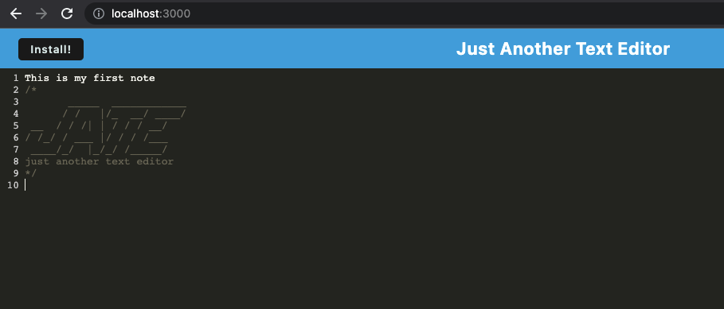
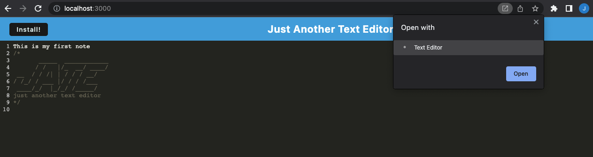
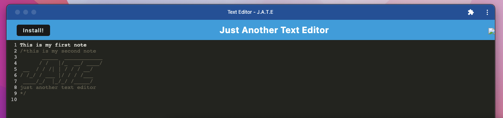
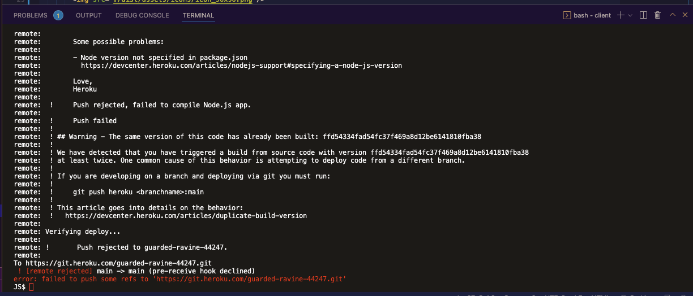

# textEditor

## <Project Text Editor>

## Table of Contents 

* [Description](#description)

* [Technologies Used](#technologies)

* [User Guide](#user-guide)

* [Link To Video](#videolink)

* [Link To Github](#githublink)

* [Questions](#questions)

## Description
This text editor allows the user to download an app to use offline. The user can then add, update and delete text notes in the app. 

## Technologies
Requires npm and uses express. The application should be deployed to Heroku but there is a known error with Heroku at the moment where it is not recognizing Node files. For this reason, I have added screenshots and a walk through video of the deployed application. 

## User-Guide
To get started, in your terminal, type in 'npm run start'
 
 
 
Screenshot of the app on my localhost/port:3000 :
 
 
 

 
 
 
The app is already downloaded so this is what it looks like when prompted to open:
 
 
 

 
 
 
The application itself:
 
 
 

 
 
 
The error being thrown from Heroku - which is really too bad. Once Heroku fixes the issue I will update:
 
 
 

 
 
 
Click on the video (below) to view the app being run through my local server. Once on the server- you can type in notes and then click on the install button. Because I've already installed the app, I just need to open it. Once opened you can see it is just a single page, it has the ability to run offline and still saves the updates to the text notes. 
 
 
 

## VideoLink
Demonstration of running the app:
 
<https://drive.google.com/file/d/1kDzdZzBBSovmIJacTqIWgviAs5NF30aJ/view>
 

## GithubLink
<https://github.com/jennyrae818/texteditor>

## Questions

If you have any questions about the repo, open an issue or contact [Jenny](undefined) directly at jennyrae818@gmail.com.